

    
# Blockchain Arcade Token
    
##### Created by [Demi Oyebanji](mailto:oluwademiladeoyebanji@outlook.com) as an assignment for the **UofT SCS Financial Technology Bootcamp**
________________________________________________________________________________________________________

In this file I created the framework for an arcade system that allows people to purchase token by taking part in a *Crowdsale*, they can then use those tokens to take part in games and activities. 

# Compile phase

## Compiled the KaseiCoin.sol file
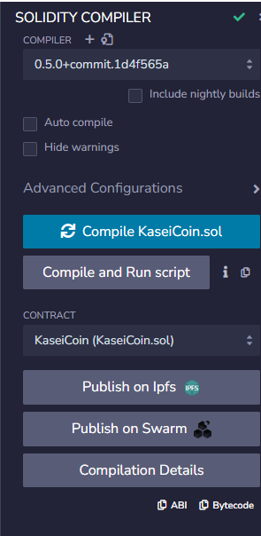

## Compiled the KaseiCoinCrowdsale contract
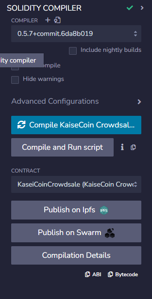

## Able to successfully compile the KaseiCoin CrowdsaleDeployer function
### Had to use Solidity 0.5.7 to make it compile
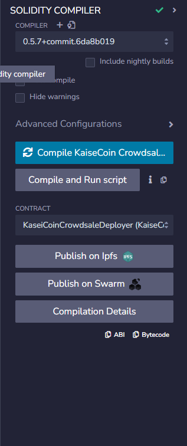

# Deploy phase 

### I deploy the Deployment Contract
I submit parameters for how I would like to name my new Token and what wallet I want to store them in.
I'm going to name my coin *'UpperKasei'* to represent a *'premium'* Arcade Token
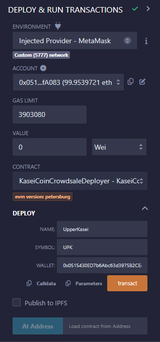

Once deployed, the output gives us a *Kasei Token Address* and a *Crowdsale Address* for your new token
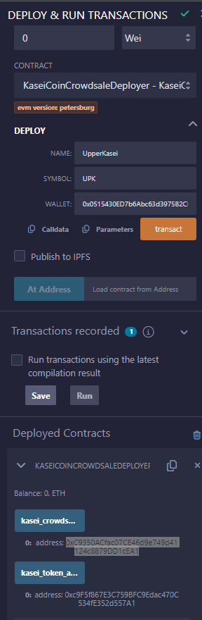

### Then I deployed the KaiseiCoin Crowdsale Contract
This includes the function that allows patrons to **buy tokens** as well as other administrative features and emmissions

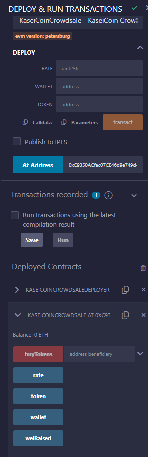 

### Then I checked the address of my new coin and looked at the functionalities offered in the KaiseCoin Contract
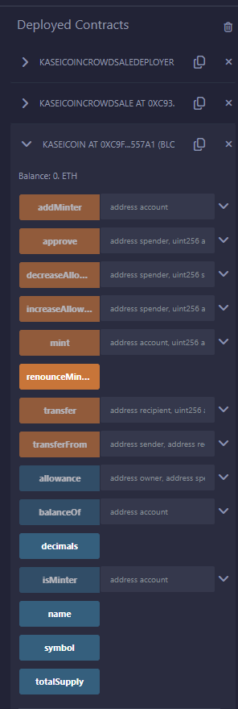
### I was also able to confirm that these transactions went through in my Test Envrionment
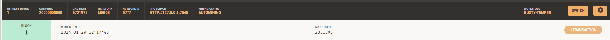
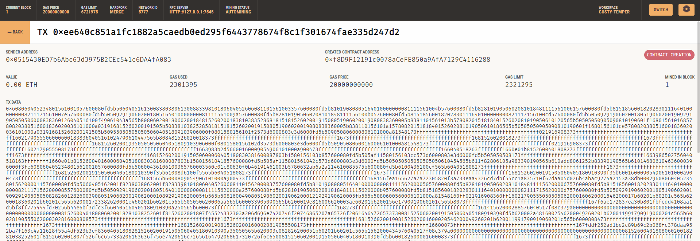

# Tests

### Bought 5ETH worth of tokens and confirmed it through MetaMask and Ganache
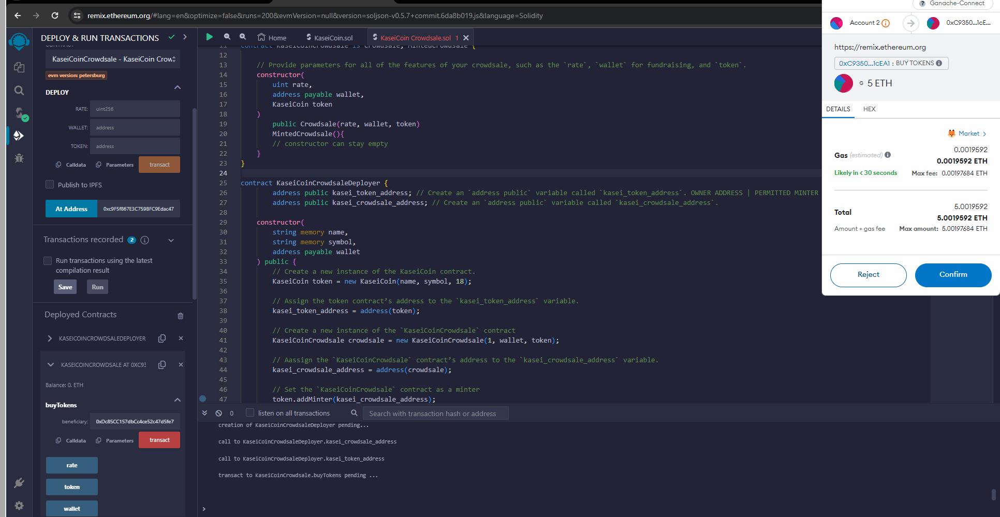
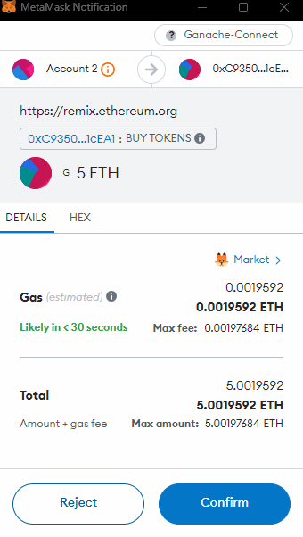
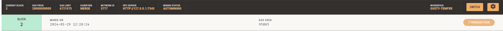
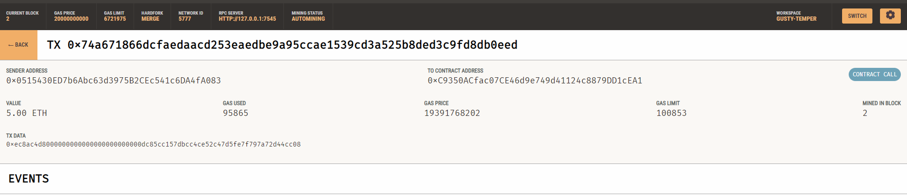

### Tested a second 10 ETH Transaction and approved it through MetaMask
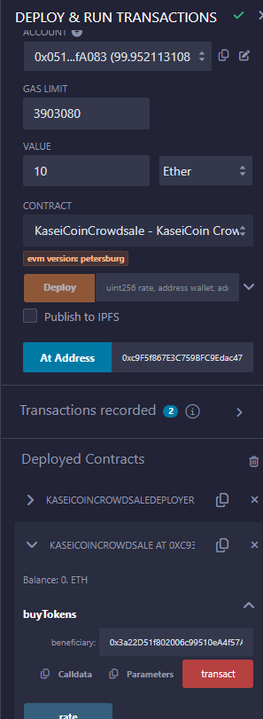
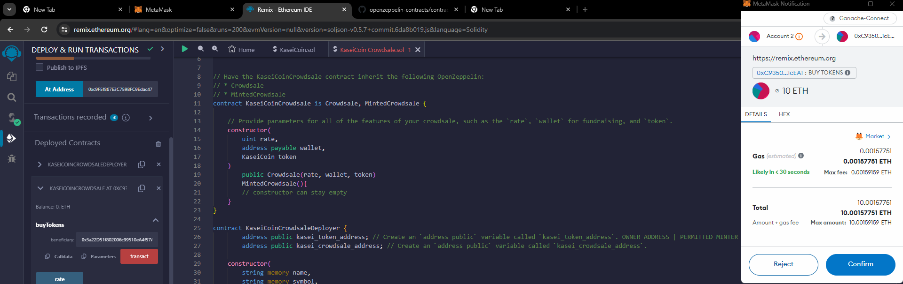

### Was able to confirm it on MetaMask, Ganache and Remix
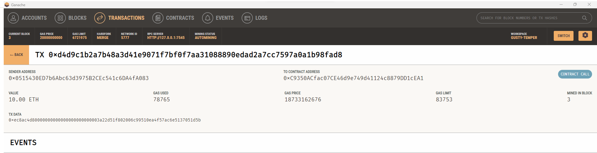
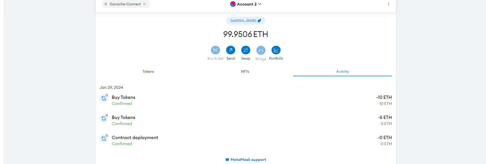

# SUCCESS - Thank you :D

