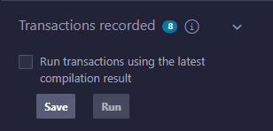
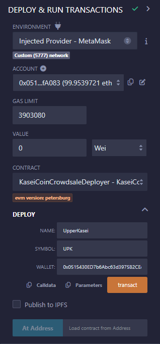
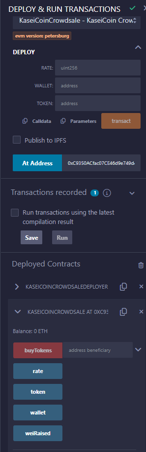
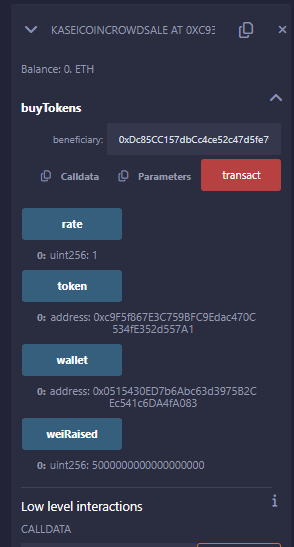
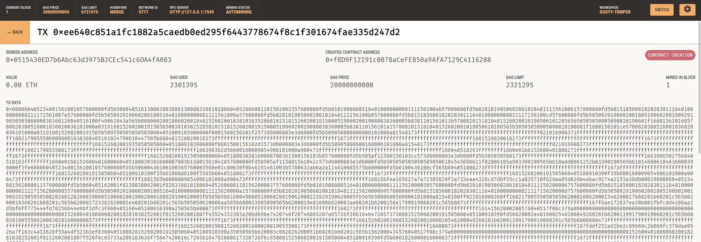
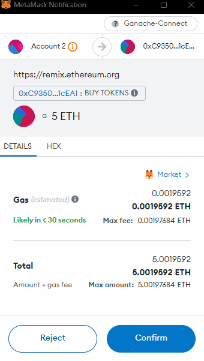
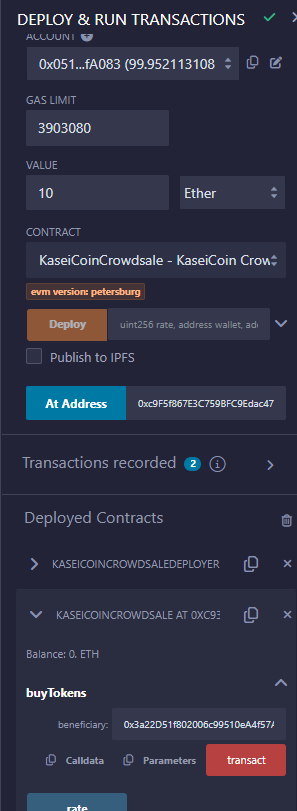
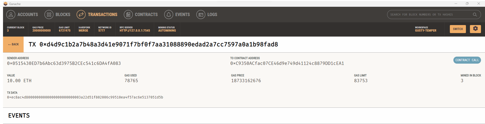

# Compile phase
Solidity files attached in directory
## Able to successfully compile the KaseiCoin.sol file

## Able to successfully compile the KaseiCoinCrowdsale function
### Had to use Solidity 0.5.7 to make it compile

## Able to successfully compile the KaseiCoin CrowdsaleDeployer function
### Had to use Solidity 0.5.7 to make it compile

# Deploy phase - First Attempt
## Was able to connect all parts
- Connected MetaMask to Ganache and Remix in browser.
- Imported an account with an appropriate amount of ether
- Set a comparable gas limit 
- Selected the first contract
- Filled the parameters and deployed

## For some reason, my contract stays pending for up to half an hour.
### Retried it a few times but no luck

### 8 Transactions registered but no final result under contracts deployed. Couldn't demo functionality

# Deploy phase - Second Attempt
## I realised it doesn't follow the same order as the compile. 

### So I had to start with the Deploy Contract

### Then I was able to also deploy the KaseiCoin Crowdsale Contract

### After which I was able to Deploy the KaseiCoin contract to mint a new coin and see the results in Ganache

# Tests

### Ran a 5 ETH Transaction and confirmed it through MetaMask and Ganache

### Tested a second 10 ETH Transaction and approved it through MetaMask

### Was able to confirm it on MetaMask, Ganache and Remix

# SUCCESS - Thank you central grader :D

